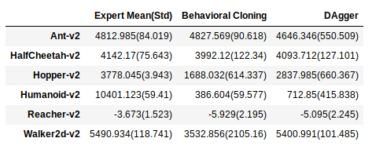
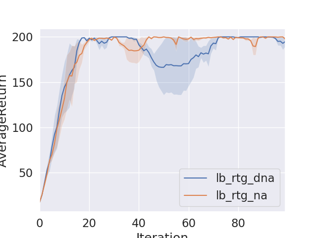

CS 294-112 | Deep Reinforcement Learning Fall 2018 - Assignment Solutions
===============

The course website: http://rail.eecs.berkeley.edu/deeprlcourse/

My own solutions for Cs294-112
  

## Project1
   ***Behavioral Cloning vs DAgger***   
  I was able to get the results below with given hyperparameter.

  

   **Learning Curves**   
   *Hopper-v2*   
  
    *Reacher-v2*   
  

   Agents with huge improvements in DAgger have shown soaring loss function in learning curves.
    

## Project2
   ***Policy Gradient Method in discrete action space and continous action space***   

  *FrozenLake-v2* 
  
  

   *HalfCheetah-v2* 
  

  1. Reward-to-go has shown improvements in performance
  2. Normalizing the advantageous function has shown reduction of the high variance
  3. Providing baseline has shown reduction of the high variance
